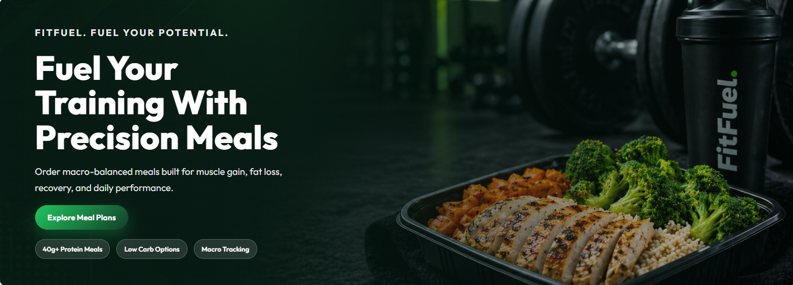
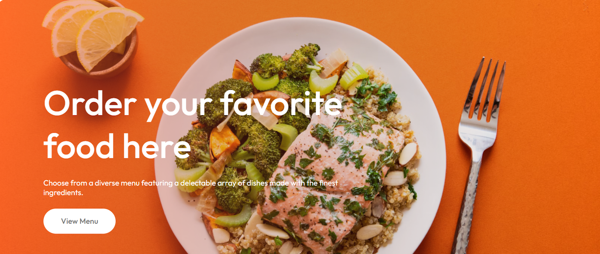
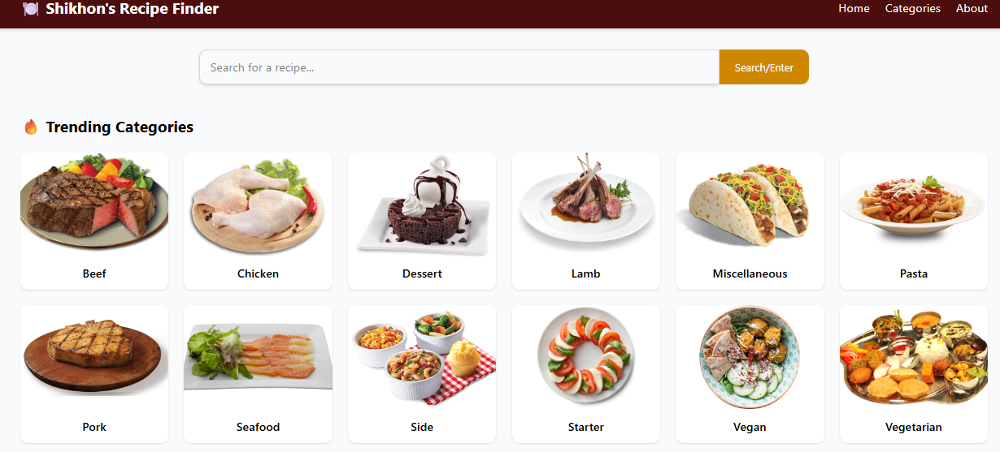

 

# Sherbaj Ahmed

### Full-Stack Developer from Dhaka, Bangladesh

Building modern, responsive, and scalable web applications with React, Next.js, Node.js, Express.js, MongoDB, and MySQL.

  
  
  
  

---

## 👨‍💻 About Me

<table>
<tr>
<td width="58%" valign="top">

I am <b>Sherbaj Ahmed</b>, a <b>Computer Science and Engineering student</b> at <b>International University of Business Agriculture and Technology (IUBAT)</b>.

I focus on <b>Full-Stack Web Development</b> and enjoy building clean, responsive, and scalable web applications.

Currently improving my skills in <b>React, Next.js, backend architecture, REST APIs, authentication, and scalable web systems</b>.

</td>
<td width="42%" valign="top">

<pre>
const sherbaj = {
  location: "Dhaka, Bangladesh",
  role: "Full-Stack Developer",
  stack: "MERN Stack",
  focus: "Scalable Web Apps"
};
</pre>

</td>
</tr>
</table>

---

## 🛠️ Tech Stack

<table>
<tr>
<td width="25%" align="center" valign="top">

<h3>Languages</h3>

</td>
<td width="25%" align="center" valign="top">

<h3>Frontend</h3>

</td>
<td width="25%" align="center" valign="top">

<h3>Backend & DB</h3>

</td>
<td width="25%" align="center" valign="top">

<h3>Tools</h3>

</td>
</tr>
</table>

---

## 📌 Featured Projects

<table>
<tr>

<td width="33%" valign="top">

<h3>🏋️ FitFuel Meal Website</h3>

A modern fitness meal landing page designed for healthy meal plans, protein-focused food, and performance nutrition.

  
  
  

  <b>Features:</b> Meal Plans, Modern Hero Section, Responsive Layout, Clean UI

  
  

</td>

<td width="33%" valign="top">

<h3>🍽️ Food Ordering Website</h3>

A visually appealing food ordering landing page where users can explore favorite dishes and view menu options.

  
  
  

  <b>Features:</b> Hero Banner, Menu CTA, Food Showcase, Responsive Design

  
  

</td>

<td width="33%" valign="top">

<h3>🍱 Recipe Finder</h3>

A recipe finder web application with search functionality and trending food categories for discovering meals easily.

  
  
  

  <b>Features:</b> Recipe Search, Categories, Food Cards, Clean Navigation

  
  

</td>

</tr>
</table>

---

## 🎓 Education

<table>
<tr>
<td width="50%" valign="top">

<h3>International University of Business Agriculture and Technology</h3>

<b>Degree:</b> Bachelor of Computer Science and Engineering
 
<b>Location:</b> Dhaka, Bangladesh
 
<b>Expected Graduation:</b> May 2026
 
<b>CGPA:</b> 3.70

  
  

</td>
<td width="50%" valign="top">

<h3>Sherpur Biggan College</h3>

<b>Level:</b> Higher Secondary Certificate
 
<b>Group:</b> Science
 
<b>Year:</b> 2020
 
<b>GPA:</b> 5.00

  
  

</td>
</tr>
</table>

---

## 📊 GitHub Analytics

  

---
## 🌐 Connect With Me

  
  
  
  

---

### Thanks for visiting my profile

